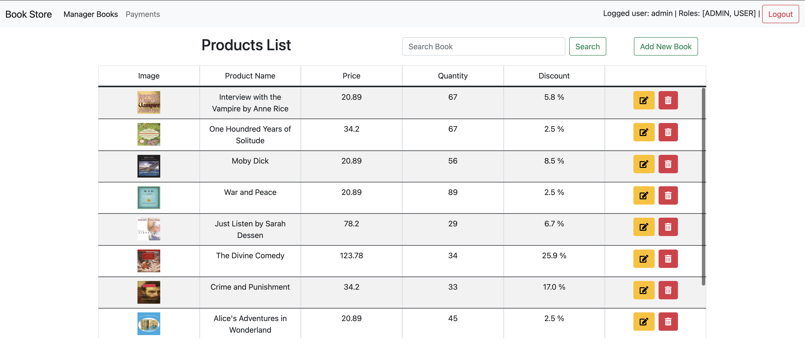
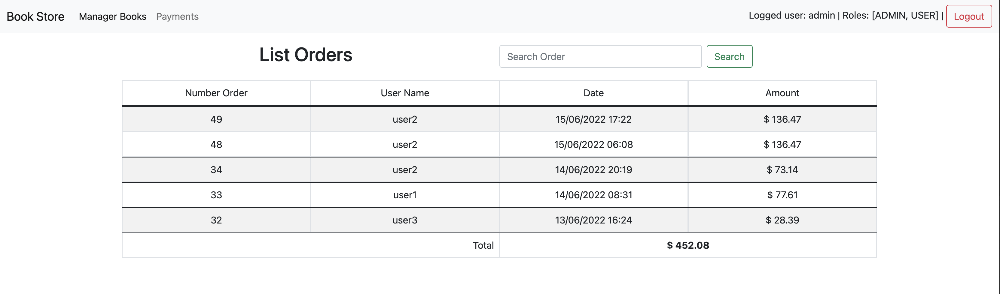
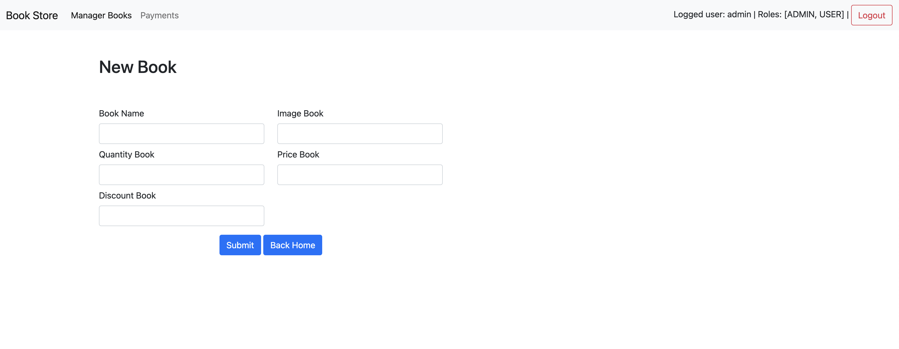
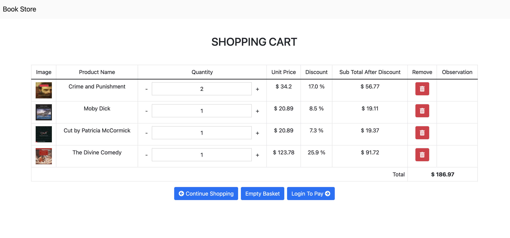
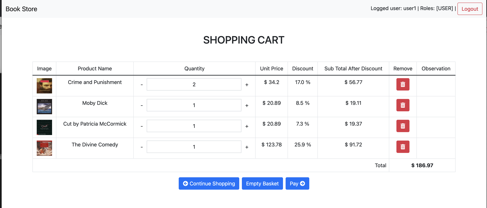
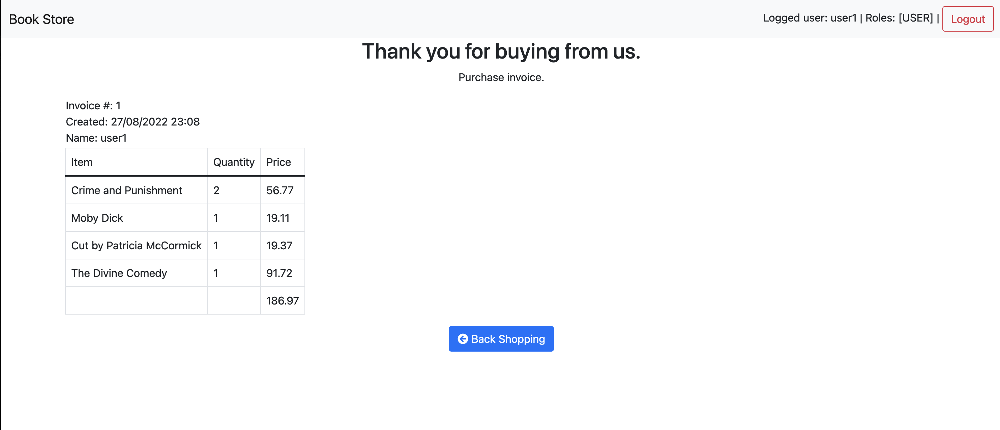

# Store Book - Study assignment at Hadassah College

A book store web application.
In the store the user able to browse different books,
add them to shopping cart and buy them.
In addition, is the admin panel, were the admin can manipulate
the book repository and view the purchase history.

## Authors
1. [David Maman](https://github.com/dmaman86)
2. [Yinon Tzomi](https://github.com/YinonTzo)

## Documentation
1. Project API (javadoc) is located in the doc folder.
2. Project SQL tables is located in the java/resources/db folder.

## Users and passwords
1. User Name: 'admin', password: 'admin'
2. User Name: 'user1', password: 'user'
3. User Name: 'user2', password: 'user'
4. User Name: 'user3', password: 'user'

## Assumptions
The site use bootstrap CDN therefore assumes an internet
connection is available.

## Execute
1. Use the sql files we provide in the java/resources/db folder or prepare a sql database.
2. Execute the program from the intellij
3. The port site is 8080 and the port of the database is 3306, you change if you wish to use other ports
4. Store url: http://localhost:8080/ and admin url: http://localhost:8080/admin

## Database Tables
1. user
2. role
3. product
4. orders

## Others
1. To add a new user you must first run the code in the util folder to get an encrypted password.
Then specify which permissions the user has in the role table in the database

2. During shopping you can buy several of the same product

3. On the admin side you can scroll through the list of books

## Screenshots

 | 
:---: | :---:
 | 
 | 